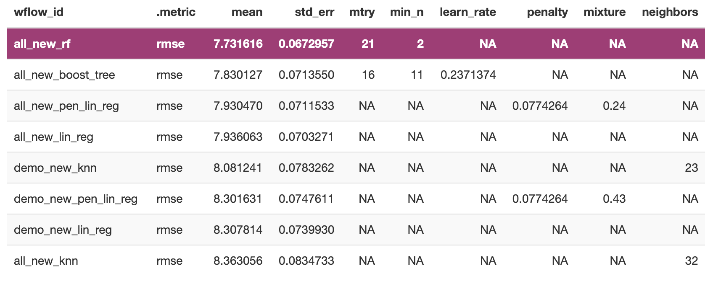
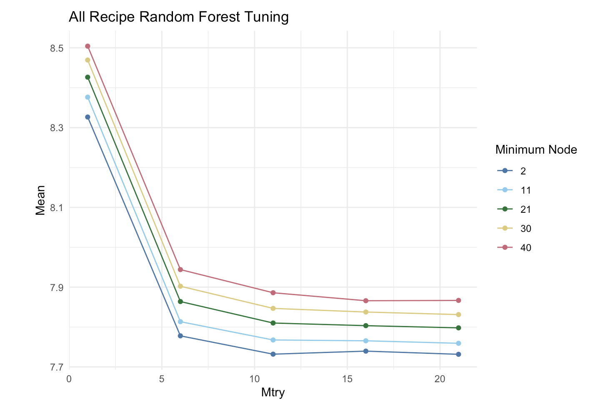

# Executive Summary: Subsidized Housing Predictive Modeling

As a student majoring in both journalism and statistics, I am often interested in the intersection of storytelling and data. To me, the best stories have both a strong storyline which connects you on a human level (anecdotes and human experience) and the data which speaks to a larger point. With this project, I wanted to begin on the data side of subsidized housing and use the results of a predictive model to investigate what is correlated with the number of subsidized housing units.

I decided to use a dataset that included the total units of subsidized housing per county per 1000 people and regressed that outcome on variables spanning both demographic and housing/area characteristics of the county. In all, that gave me approximately 30 variables to work with as predictors. Using a numeric outcome, I knew there were five general categories of models that would be important to test: penalized linear regression, simple linear regression, K-nearest neighbors, boosted regression trees, and random forest regression.

After going through the model tuning process, two models stood out as the best: the retuned boosted regression tree and the random forest regression. I had initially wanted to see whether demographic variables were more successful than including housing/area characteristic data, but for all models except the KNN model, using all the predictors proved to be the best. Below you can see the top models from every algorithm and that the random forest model was the clear winner.

Rather go with the strict top model within the random forest workflow set, I decided to add a bit of context. I wanted to choose a somewhat simpler model than was offered by having a minimum node size of two. I was worried that this could potentially cause overfitting issues and thus I instead decided to look at the tuned results closer.

Since the difference between 2 and 11 were quite small (within a standard error), I decided instead to use a model with a larger minimum node size (11) and since the pay off for increasing `mtry` was small after 10, I decided to use a smaller size `mtry` value (11). These specifications were able to explain 40% of the variation in the test data and yielded an RMSE that was lower than that of the null model by an economically significant amount. However, there are still questions as to what perhaps could explain the variation in subsidized housing and what affects such differences. I would like to conduct interviews that could provide me with more qualitative context for the problem and perhaps lead me to other data sources I missed.
